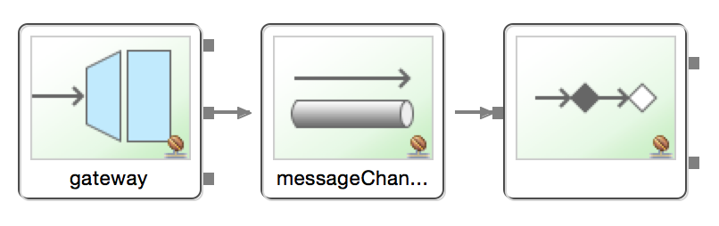
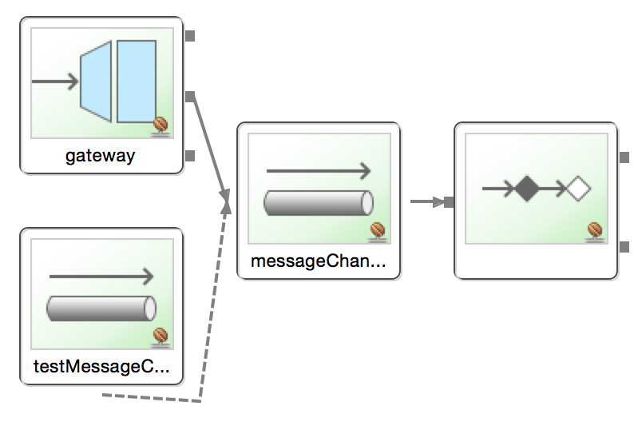

# Testing Spring Integration Workflows

This is an example demonstration of testing messaging workflows in the [Spring Integration] [] framework to verify system behaviour, workflows or sequences at various points of the system lifecycle.

## Overview 

Spring Integration is an extension of Spring that supports [Enterprise Integration Patterns] []. It facilitates easy implementation of patterns but also implementation of intra jvm messaging, scheduling and remoting to external systems.

Writing integration tests that verify individual messaging components within the framework is not simple, requiring a strategy to ensure correctness of the workflow based on sequential and temporal aspects naturally.

For this purpose I have devised a testing strategy that allows inspection of a message in a particular channel without interrupting the application workflow during the test.

The strategy is to utilize the [Wire Tap][] pattern to copy messages placed on a particular message channel to another channel from which it can be read and inspected. The Wire Tap preserves the sequence/ordering of messages on a channel and also temporal aspects as the message copy is at the same point in time. 

## Walkthrough of the application workflow



The application workflow itself is simple: The application generates a `Hello World!` message that is sent through a [Gateway][] onto a [Message Channel][] that is consumed by a [Message Endpoint][] to print out the message to console.

There are several files in the source tree under the src/main/ root folder:
- **App.java**: The main application class that will load the Spring Integration Framework and send a message through the gateway.
- **Gateway.java**: The interface that represents the message gateway.
- **MessageReceiver.java**: The message endpoint that consumes the message on the channel and prints it out to the console.
- **spring-integration-context.xml**: The Spring Integration context file that defines the messaging workflow and lifecycle of the application; the message channel; the definition of the components and relationship with each other; component activation and tying it all into place.

### Running the application
Run the `App` class as a Java application. It will print out several Spring Framework INFO thershold log entries during the start up and shut down of the application.  
In between the Spring log messages, you will see in the console the following output: 

```
Message received - Hello world!
```

At this point the application has successfully generated a message and sent on a channel that is consumed and processed.

## Walkthrough of the test workflow



There are two files in the source tree under the src/test root folder:
- **spring-integration-test-context.xml**: The Spring Integration context file that is loaded for the test only. It imports the application's **spring-integration-context.xml** file but also creates the Wire Tap and the additional channel to copy the message onto for the test to read and inspect from. 
- **MessageReceiverTest.java**: The JUnit test class that sends a test message through the gateway, consumes the message from the additional channel that the Wire Tap has delivered to and verifies the message is the same as what was sent through the gateway. 


### Running the test
Run the `MessageReceiverTest` as a JUnit Test. It will print out several Spring Framework INFO thershold log entries during the start up and shut down of the application.  
In between the Spring log messages, you will see in the console the following output: 

```
Message received - Test Message!
Message received in test channel - Test Message!
```

The first console output is from the normal application messaging workflow as demonstrated earlier. The second console output is generated by the test, illustrating the the content of the message from the additional channel the Wire Tap has delivered to.

## Conclusion

Although the example is simple, it demonstrates a capability to inspect the workflow of asynchronous messaging systems where multiple channels exist in the application that receive or process messages at different points in the workflow or time.
I use this testing approach in my large scale Spring Integration applications and provides great benefit when validating the application in integration tests of components or end-to-end tests of the application's workflow as a whole.

[Spring Integration]: https://projects.spring.io/spring-integration/ 
[Enterprise Integration Patterns]: http://www.eaipatterns.com/
[Wire Tap]: http://www.enterpriseintegrationpatterns.com/patterns/messaging/WireTap.html
[Gateway]: http://www.enterpriseintegrationpatterns.com/patterns/messaging/MessagingGateway.html
[Message Channel]:http://www.enterpriseintegrationpatterns.com/patterns/messaging/MessageChannel.html
[Message Endpoint]: http://www.enterpriseintegrationpatterns.com/patterns/messaging/MessageEndpoint.html